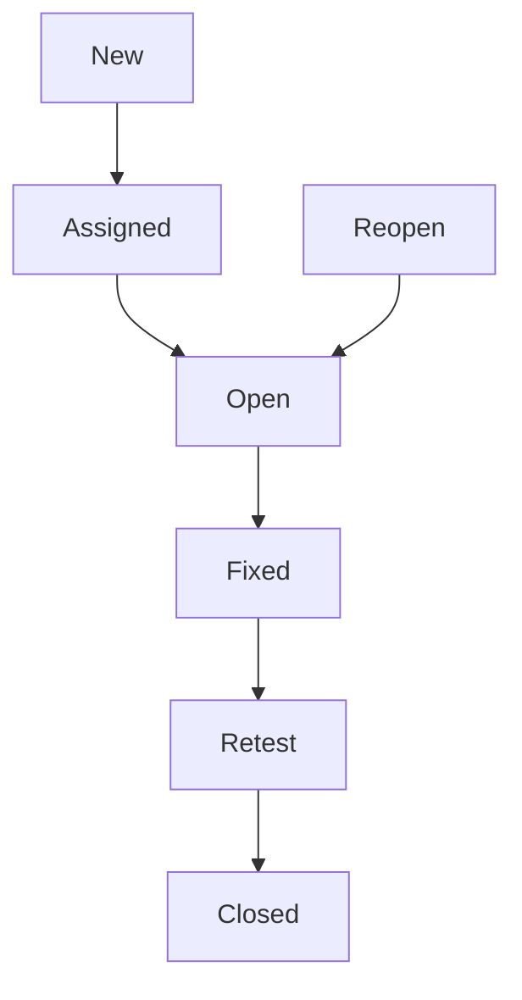
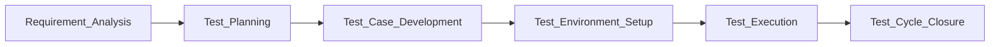

# 🧪 Software Testing Guide

## Table of Contents

1. [Introduction](#introduction)
2. [Why Software Testing?](#why-software-testing)
3. [Types of Software Testing](#types-of-software-testing)
4. [Manual Testing](#manual-testing)

   * [Test Case](#test-case)
   * [Test Plan](#test-plan)
   * [Bug Life Cycle](#bug-life-cycle)
5. [Automation Testing](#automation-testing)

   * [Tools Overview](#tools-overview)
   * [Selenium Example](#selenium-example)
6. [Testing Methodologies](#testing-methodologies)
7. [Software Testing Life Cycle (STLC)](#software-testing-life-cycle-stlc)
8. [Best Practices](#best-practices)
9. [FAQ](#frequently-asked-questions-faq)
10. [Resources & Learning](#resources--learning)
11. [Sample Screenshots](#sample-screenshots)

---

## Introduction

Software Testing ensures **quality, functionality, and performance** of software. It helps find defects before release and improves user experience.

---

## Why Software Testing?

* ✅ Detect bugs early
* ✅ Ensure requirements are met
* ✅ Enhance software reliability
* ✅ Improve customer satisfaction

---

## Types of Software Testing

| Type                   | Description                                        |
| ---------------------- | -------------------------------------------------- |
| Functional Testing     | Tests features/functions against requirements      |
| Non-Functional Testing | Tests performance, usability, reliability          |
| Manual Testing         | Human-driven testing without automation            |
| Automation Testing     | Uses tools/scripts to test software                |
| Regression Testing     | Ensures changes don’t break existing functionality |
| Smoke & Sanity Testing | Quick checks before deeper testing                 |

---

## Manual Testing

Manual testing is performed **without automation tools**.

### Test Case

A document specifying inputs, steps, and expected results.

| Test Case ID | Description                  | Steps                                                       | Expected Result | Status    |
| ------------ | ---------------------------- | ----------------------------------------------------------- | --------------- | --------- |
| TC001        | Login with valid credentials | 1. Open website 2. Enter username & password 3. Click login | User logged in  | Pass/Fail |

### Test Plan

Document describing **scope, approach, resources, and schedule** for testing.

**Components:**

* Test objectives
* Features to be tested
* Testing strategy
* Entry & exit criteria

### Bug Life Cycle



---

## Automation Testing

Automation reduces repetitive effort.

### Tools Overview

* Selenium (Web)
* Appium (Mobile)
* JUnit/TestNG (Unit Testing)
* Postman (API Testing)

### Selenium Example

```python
from selenium import webdriver

driver = webdriver.Chrome()
driver.get("https://www.example.com")
print(driver.title)
driver.quit()
```

---

## Testing Methodologies

### Black Box Testing

* Tests without knowing internal code
* Focus: Input & output

### White Box Testing

* Tests internal code logic
* Focus: Code coverage, loops, conditions

### Grey Box Testing

* Combination of Black & White Box
* Focus: Limited internal knowledge

---

## Software Testing Life Cycle (STLC)



---

## Best Practices

* ✍️ Write clear and concise test cases
* 🔹 Prioritize testing based on risk
* ⚙️ Automate repetitive tasks
* 📊 Track and report defects efficiently
* 📚 Continuously learn new tools & techniques

## Resources & Learning

* [Software Testing Help](https://www.softwaretestinghelp.com/)
* [Guru99 - Software Testing](https://www.guru99.com/software-testing.html)
* [ISTQB Foundation Syllabus](https://www.istqb.org/)
* [Selenium Documentation](https://www.selenium.dev/documentation/en/)

---

## Sample Screenshots

### Test Case Example


### Selenium Execution


### Bug Tracker


---

## 🛤️ Software Testing Learning Path

This learning path is structured to take you **from beginner to advanced** in software testing with practical mini-projects.

---

### **1️⃣ Beginner Level**

**Goal:** Understand basic testing concepts and manual testing.

**Topics to Learn:**

* What is Software Testing
* Types of Testing (Functional, Non-Functional, Manual)
* Test Cases & Test Plans
* Bug Life Cycle
* STLC Basics

**Mini Projects:**

* Create 5–10 test cases for a simple website (e.g., Login form, Contact form)
* Manually test a calculator app for all operations and document bugs

**Suggested Duration:** 1–2 weeks

---

### **2️⃣ Intermediate Level**

**Goal:** Start automation and explore more testing techniques.

**Topics to Learn:**

* Regression Testing
* Smoke & Sanity Testing
* Exploratory Testing
* Automation Basics with Selenium
* API Testing using Postman

**Mini Projects:**

* Automate login, search, and form submission on a demo website
* Test a simple REST API using Postman and document responses
* Implement a bug tracker using Excel or Google Sheets

**Suggested Duration:** 2–3 weeks

---

### **3️⃣ Advanced Level**

**Goal:** Master automation frameworks, testing methodologies, and real-world scenarios.

**Topics to Learn:**

* Advanced Selenium (Page Object Model, Waits, Locators)
* Unit Testing with JUnit/TestNG
* CI/CD Integration for automated tests
* Performance Testing (JMeter)
* Security Testing Basics
* Test Metrics & Reporting

**Mini Projects:**

* Build a complete Selenium automation framework for a demo e-commerce website
* Integrate automated tests with GitHub Actions or Jenkins
* Conduct performance testing on a sample website and generate reports

**Suggested Duration:** 3–4 weeks

---

### **4️⃣ Expert Level / Industry Ready**

**Goal:** Be ready for real-world software testing jobs.

**Topics to Learn:**

* Advanced Test Automation Frameworks (Selenium + Python/Java)
* API Automation with RestAssured or Postman + Newman
* Agile Testing Practices & Scrum
* Continuous Testing & DevOps Integration
* ISTQB Certification Preparation

**Mini Projects:**

* Build an end-to-end testing framework for a multi-page website
* Automate API and UI testing in one unified framework
* Document testing strategies, reports, and defect metrics professionally

**Suggested Duration:** 4–6 weeks

---

💡 **Tip:** Follow this path progressively. Start with manual testing projects, then automate small tasks, and finally build full frameworks to become industry-ready.

---

If you want, I can **now combine everything into a single, fully polished GitHub README** with:

* Badges
* Diagrams (STLC & Bug Life Cycle)
* Sample screenshots
* Learning path
* Mini-project suggestions


