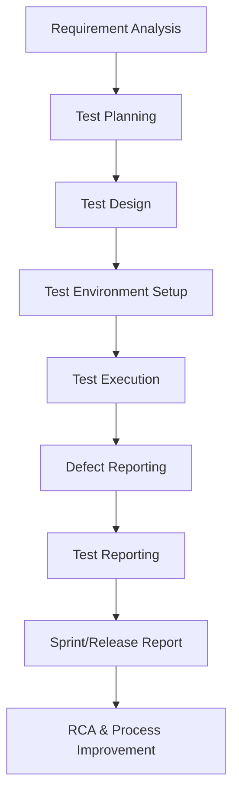

# 🧪 Software Testing Practical Workflow

Welcome to the **Software Testing Workflow Guide** 🚀.
This repo is designed to help **beginners → advanced testers** understand the **real-world software testing workflow** with **hands-on experience** using popular tools.

---

## 🔄 End-to-End Workflow of Software Testing

### 1️⃣ Requirement Analysis

* Understand what the **client or user wants**.
* Read **SRS (Software Requirement Specification)** / user stories.
* Discuss ambiguities with stakeholders.

📌 *Tools:* JIRA, Confluence, Trello

---

### 2️⃣ Test Planning

* Define **scope, objectives, resources, risks, and timeline**.
* Decide which types of testing (Manual, Automation, API, Security, etc.).

📌 *Document:* [Test Plan Template](./templates/TestPlan.docx)
📌 *Tools:* JIRA, TestRail, Zephyr

---

### 3️⃣ Test Design (Scenarios & Cases)

* Write **Test Scenarios** (high-level situations).
* Write **Test Cases** (step-by-step test instructions).
* Create **RTM (Requirement Traceability Matrix)** to map requirements → test cases.

📌 *Documents:*

* [Test Case Template](./templates/TestCase.xlsx)
* [RTM Template](./templates/RTM.xlsx)

📌 *Tools:* Excel, TestRail, Zephyr, qTest

---

### 4️⃣ Test Environment Setup

* Prepare the **hardware, software, network, and tools** needed.
* Install builds and ensure environment matches production as closely as possible.

📌 *Tools:* Docker, Jenkins, AWS, Virtual Machines

---

### 5️⃣ Test Execution

* Run the test cases step by step.
* Mark results as **Pass / Fail / Blocked / Not Executed**.

📌 *Tools:* Selenium, Postman, JMeter, Cypress, Playwright

---

### 6️⃣ Defect Reporting & Tracking

* If test fails → Raise a **Bug Report**.
* Track bug status (**New → Open → Fixed → Retest → Closed/Rejected**).

📌 *Document:* [Bug Report Template](./templates/BugReport.docx)
📌 *Tools:* JIRA, Bugzilla, Mantis

---

### 7️⃣ Test Reporting

* Prepare a **Test Summary Report** at the end.
* Share test coverage, defects found, defect severity, execution status.

📌 *Document:* [Test Report Template](./templates/TestReport.docx)
📌 *Tools:* Excel, JIRA, TestRail

---

### 8️⃣ Sprint & Release Reporting (Agile)

* In Agile, testing is done in **sprints**.
* Prepare **Sprint Reports** after every iteration.

📌 *Document:* [Sprint Report Template](./templates/SprintReport.docx)
📌 *Tools:* JIRA Agile Boards, Azure DevOps

---

### 9️⃣ Root Cause Analysis (RCA)

* After critical bugs, perform RCA to find **why it happened**.
* Helps prevent future bugs by fixing process gaps.

📌 *Document:* [RCA Template](./templates/RCA.docx)

---

## 📊 Visual Workflow



---

## ⚙️ Hands-On Tools to Try

| Activity               | Tool Options                    |
| ---------------------- | ------------------------------- |
| Requirement Management | JIRA, Confluence                |
| Test Case Management   | TestRail, Zephyr, Excel         |
| API Testing            | Postman, RestAssured            |
| Automation Testing     | Selenium, Cypress, Playwright   |
| Performance Testing    | JMeter, Locust                  |
| CI/CD & Test Env       | Jenkins, Docker, GitHub Actions |
| Bug Tracking           | JIRA, Bugzilla                  |

---

## 📂 Repo Structure

```
/templates
   ├── TestPlan.docx
   ├── RTM.xlsx
   ├── TestCase.xlsx
   ├── BugReport.docx
   ├── TestReport.docx
   ├── SprintReport.docx
   └── RCA.docx
/workflow
   ├── practical_workflow.md
   └── workflow_diagram.png
```

---

## ✅ How to Use This Repo

1. **Clone the repo**

   ```bash
   git clone https://github.com/your-username/software-testing-workflow.git
   ```
2. Go to **/templates** → Pick any template.
3. Start your own project using this **workflow + tools**.
4. Share your **practical testing reports** in your own repo.

---

## 🚀 Pro Tip

👉 Start small (Excel + JIRA) → then move to advanced (Automation, CI/CD).
👉 Keep all your test documents versioned in GitHub for practice.

---
